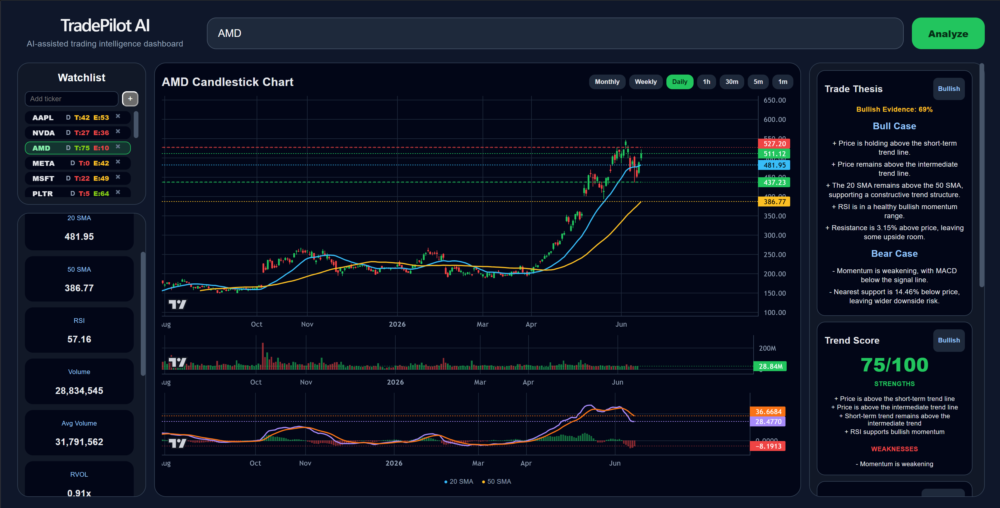
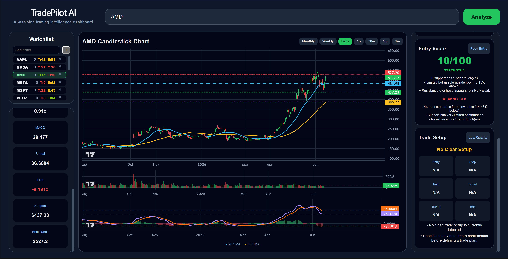
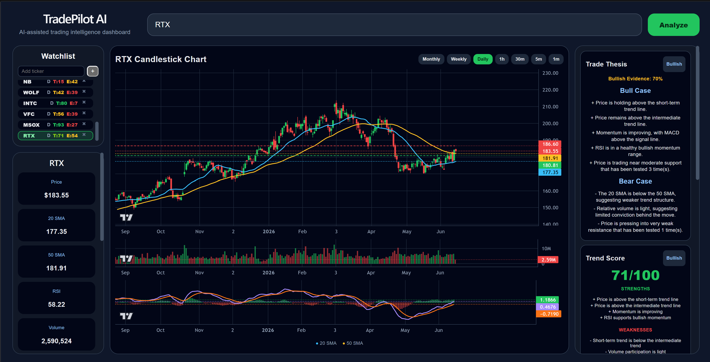
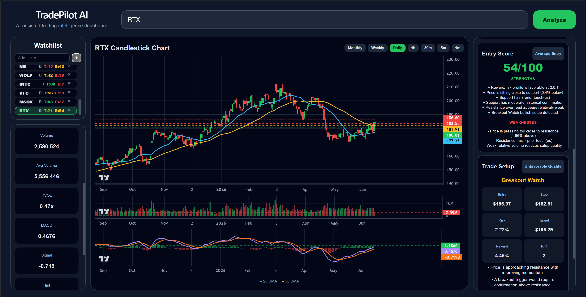

# TradePilot AI

AI-powered financial analysis platform built with Python, FastAPI, React, and real-time market data.

---

## Overview

TradePilot AI is a full-stack trading intelligence platform I designed and developed to help traders evaluate market opportunities through data-driven technical analysis.

The project began as a personal challenge to build a professional-grade market analysis tool from scratch while expanding my skills in software engineering, data analytics, product development, and system design.

TradePilot AI combines market visualization, technical indicators, trend scoring, support and resistance analysis, and AI-generated trade thesis generation into a single platform.

---

## Project Goals

The objective was to create a platform that could:

- Analyze securities across multiple timeframes
- Identify trend strength and momentum
- Generate actionable bullish and bearish trade scenarios
- Provide clear market visualizations
- Consolidate technical analysis into a single workflow

Instead of relying on multiple disconnected tools, TradePilot AI presents all critical information in one dashboard.

---

# Screenshots

## AMD Daily Analysis

Multi-timeframe analysis dashboard displaying trend structure, support/resistance levels, moving averages, RSI, MACD, and volume participation.

---

## AMD Trade Setup

Example of TradePilot AI generating a structured bullish and bearish trade thesis based on technical market conditions.

---

## RTX Daily Analysis

Daily market evaluation using custom scoring algorithms and technical indicators.

---

## RTX Trade Setup

Trade thesis engine combining technical indicators and market structure into an evidence-based analysis.

---

# Key Features

### Multi-Timeframe Analysis

Analyze securities across:

- Monthly
- Weekly
- Daily
- 1 Hour
- 30 Minute
- 5 Minute
- 1 Minute

---

### Technical Indicators

Integrated analysis using:

- 20 SMA
- 50 SMA
- RSI
- MACD
- Relative Volume
- Volume Analysis
- Support & Resistance Detection

---

### Trade Thesis Engine

Automatically generates:

- Bull Case
- Bear Case
- Technical Evidence
- Momentum Assessment
- Risk Considerations

---

### Trend Scoring System

Custom scoring algorithm evaluates:

- Trend quality
- Momentum strength
- Moving average alignment
- Relative volume
- Support and resistance structure

---

### Interactive Dashboard

Features include:

- Watchlist management
- Real-time chart visualization
- Technical indicator overlays
- Multi-timeframe navigation
- Trade setup evaluation

---

# Technology Stack

## Backend

- Python
- FastAPI
- Pandas
- yFinance

## Frontend

- React
- JavaScript
- CSS

## Visualization

- TradingView Lightweight Charts

## Development Tools

- Git
- GitHub
- VS Code

---

# Architecture

Frontend (React)

↓

FastAPI Backend

↓

Market Data Layer

↓

Technical Analysis Engine

↓

Trend Scoring System

↓

Trade Thesis Generation

---

# What I Learned

Through this project I gained experience with:

- Full-stack application development
- REST API design
- State management in React
- Financial data processing
- Technical analysis implementation
- Git version control workflows
- Product design and feature prioritization
- Software architecture and debugging

---

# Future Development

Planned enhancements include:

- AI-powered stock scanner
- Portfolio tracking
- Trade journaling
- User authentication
- Cloud deployment
- Pattern recognition and alerting
- Advanced market screening tools

---

# Author

### Markus Barcal

Engineering Management Graduate  
Product Builder | Data Analytics & AI | Full-Stack Development

GitHub: https://github.com/markusbarcal1
