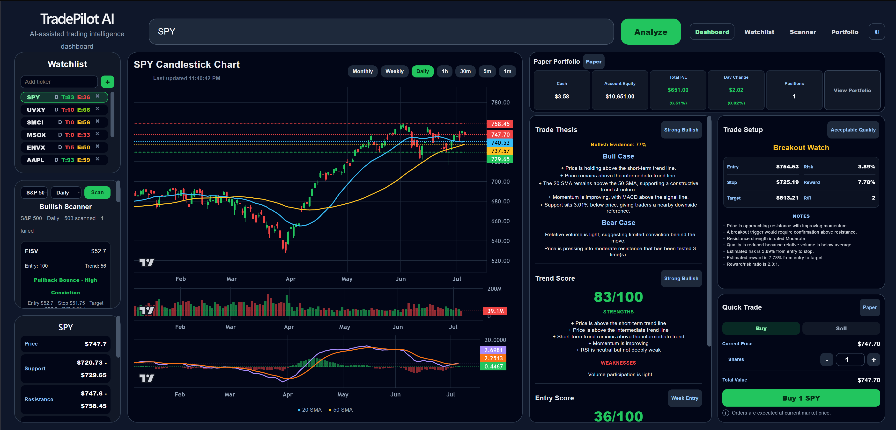
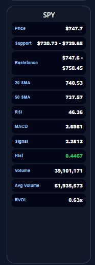
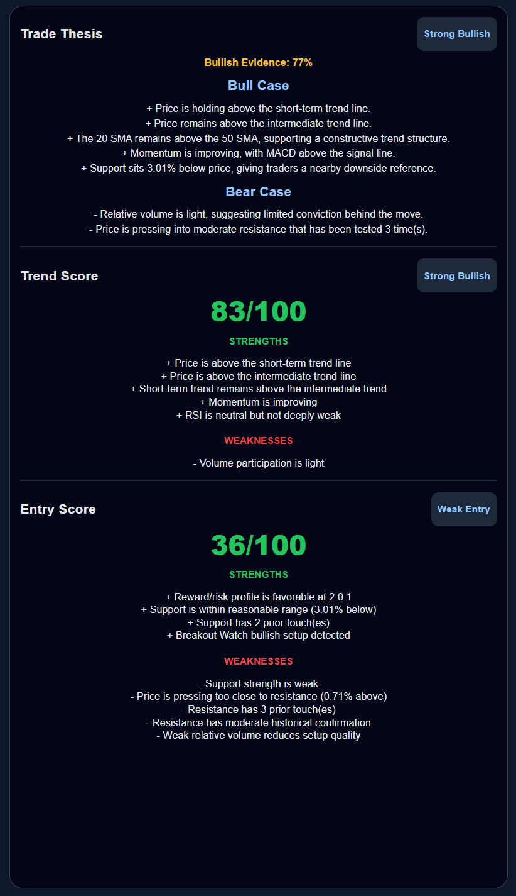
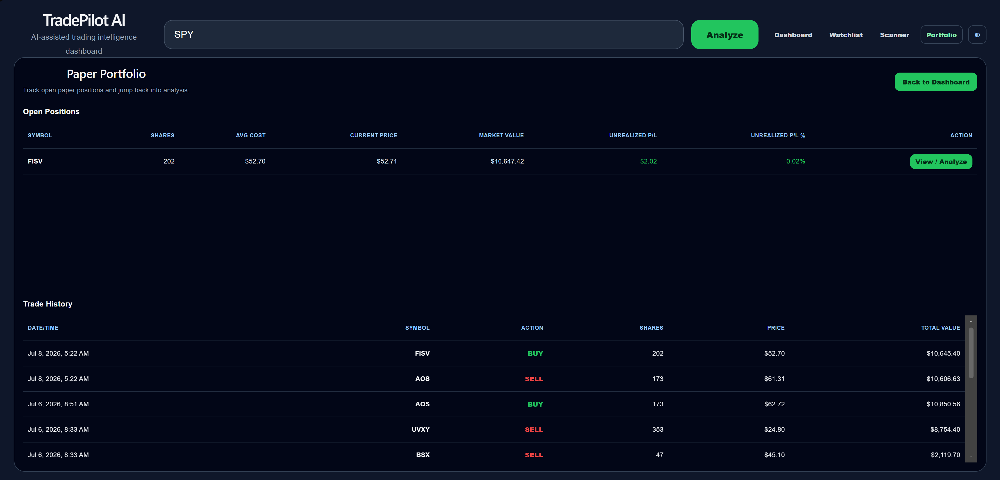
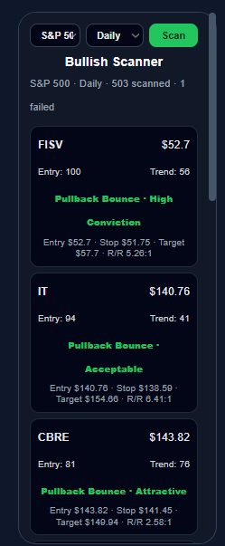

# TradePilot AI

TradePilot AI is a full-stack market analysis and paper trading workspace built with Python, FastAPI, and React. It combines technical analysis, multi-timeframe charting, trade setup generation, watchlist monitoring, and a paper trading workflow into a single local dashboard.

---

## Overview

This project was built as a personal full-stack engineering exercise to explore how technical analysis, market data, and interactive dashboards can be combined into one workflow. The current version is a functional prototype that pulls live market data and presents a structured view of trend conditions, support and resistance, trade ideas, and simulated portfolio activity.

The analysis engine is currently rule-based and deterministic rather than powered by a large language model. It focuses on technical indicators, scoring, and setup logic to help users evaluate market conditions.

---

## Current Features

### Market Analysis

- Analyze a single ticker or batch-analyze multiple symbols
- Switch between multiple timeframes: Monthly, Weekly, Daily, 1 Hour, 30 Minutes, 5 Minutes, and 1 Minute
- View key technical metrics including:
  - 20-period SMA
  - 50-period SMA
  - RSI
  - MACD
  - Relative volume
  - Support and resistance zones
- Generate a structured trade thesis with bullish and bearish evidence
- Produce trade setup recommendations with entry, stop, target, and risk/reward estimates

### Watchlist and Scanning

- Manage a customizable watchlist of symbols
- Validate ticker symbols before adding them
- Refresh watchlist scores in the background
- Scan the market for bullish setups using a scanner for the S&P 500 and Nasdaq universes
- Stream scanner progress and results from the backend

### Paper Trading

- Simulate trades with a built-in paper trading account
- Track cash balance, open positions, unrealized P/L, and portfolio equity
- Record buy and sell activity in a trade history view
- View portfolio performance from the dedicated portfolio screen

### Dashboard Experience

- Interactive charting experience with timeframe switching
- Summary panels for market metrics, trend score, entry score, thesis, and trade setup
- Quick trade entry panel for paper trading actions
- Polling-based refresh for analysis, portfolio, and watchlist data

---

## Screenshots

### Dashboard Overview

### Technical Analysis View

### Trade Thesis / Setup

### Paper Trading / Portfolio

### Scanner / Watchlist

---

## Technology Stack

### Backend

- Python
- FastAPI
- Uvicorn
- yFinance
- pandas
- numpy
- SQLite for local paper trading persistence

### Frontend

- React
- Vite
- JavaScript
- Axios
- Lightweight Charts
- Recharts
- CSS
- ESLint

---

## Architecture

The application follows a simple three-layer structure:

Frontend (React UI)
↓
FastAPI backend
↓
Market data and analysis services

The backend exposes REST endpoints for ticker analysis, batch analysis, scanning, validation, and paper trading operations. The frontend consumes those endpoints and renders the dashboard, charts, scores, thesis, and portfolio views.

---

## Backend API Surface

The current backend includes endpoints for:

- Health and validation
  - GET /health
  - GET /validate/{ticker}
- Market analysis
  - GET /analyze/{ticker}
  - POST /analyze/batch
- Market scanning
  - GET /scan
  - GET /scan/stream
- Paper trading
  - GET /paper/account
  - GET /paper/positions
  - GET /paper/trades
  - GET /paper/portfolio
  - POST /paper/buy
  - POST /paper/sell

---

## Current Status

This is a functional local prototype for experimentation and learning. It uses live market data from Yahoo Finance and is intended for education and personal analysis rather than as a production trading platform or financial advice tool.

---

## What I Learned

Through this project I gained experience with:

- Full-stack application development
- REST API design
- State management in React
- Financial data processing
- Technical analysis implementation
- Local data persistence with SQLite
- Product design and feature prioritization
- Software architecture and debugging

---

## Future Development

Planned enhancements include:

- More advanced chart overlays and indicators
- Alerting and notification workflows
- Trade journaling and richer portfolio analytics
- User authentication and cloud deployment
- More sophisticated scanner filters and ranking logic
- Expanded risk management and position sizing tools

---

## Author

### Markus Barcal

Engineering Management Graduate
Product Builder | Data Analytics & AI | Full-Stack Development

GitHub: https://github.com/markusbarcal1
