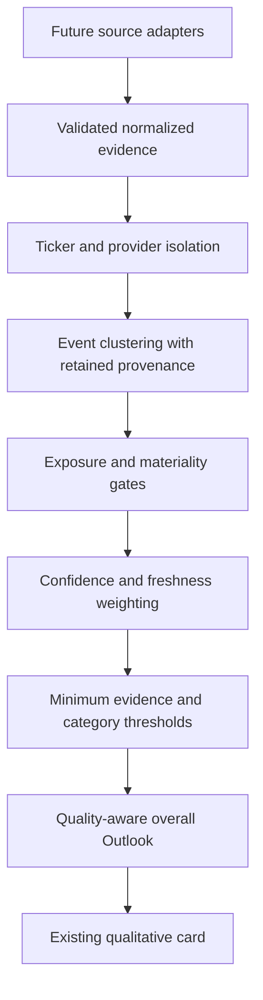

# Outlook Phase 2: Evidence Architecture

## Scope and runtime behavior

Phase 2 adds an offline, deterministic evidence domain. It does not connect sources or produce live assessments. `GET /outlook/{ticker}` remains authenticated and uses the empty `internal_placeholder` provider. The Outlook card remains unchanged and explicitly says intelligence is not connected. No credentials, network adapters, LLMs, databases, scanner changes, recommendations, or score changes were introduced.

The response metadata version is now `1.1` for additive evidence fields. Existing labels, categories, null states, and endpoint remain compatible. Phase 1's architecture document describes the earlier category-provider boundary; the evidence boundary below supersedes it.

Adapters deliver evidence only. They cannot return category or overall labels. Future interpretation or AI extraction must pass through the same validated evidence boundary. A fixture provider can be injected in tests; there is no production provider selector or live-enable switch.

## Evidence model and normalization

`OutlookEvidence` represents one source observation of one underlying event, interpreted for one ticker. An event can have multiple observations. Fields:

- `schema_version` (`1.0`), stable `id`, normalized uppercase `ticker`.
- Existing `category`, controlled `event_type`, `title`, `summary`.
- `source`, vendor-independent `source_type`, optional HTTP(S) `source_url`.
- UTC-aware `published_at`, `observed_at`, optional `expires_at`.
- `impact`, `confidence`, `materiality`, required `materiality_reason`.
- Optional typed `exposure_links`, each with a relationship kind, description, and optional source URL.
- `raw_provider`, optional `raw_provider_id`.

Normalization trims required strings, uppercases ticker, converts aware timestamps to UTC, rejects naive timestamps, requires observation at or after publication, and requires expiration after publication. Unknown fields, categories, event types, category/event mismatches, out-of-range weights, NaN, infinity, invalid URLs, and unknown source types are rejected. Publication is the information release time, not a future scheduled earnings date.

Providers must supply stable IDs, not random IDs on each fetch. Each batch is validated before acceptance. Records with the wrong ticker or delivering-provider identity invalidate that provider's batch. Other providers continue independently. Rejected batches do not partially influence an assessment.

## Controlled taxonomies

`outlook_taxonomy.py` centralizes the six categories and all 52 event types:

| Category | Event types |
| --- | --- |
| Company | management_change, acquisition, divestiture, partnership, product_launch, contract_award, legal_action, regulatory_action, cybersecurity_event, restructuring, buyback, capital_raise, operational_update, corporate_other |
| Earnings | earnings_result, earnings_upcoming, guidance_raise, guidance_cut, estimate_revision_up, estimate_revision_down, revenue_surprise, earnings_surprise, margin_change, earnings_other |
| Industry | industry_demand, supply_change, competitor_event, regulatory_industry_change, commodity_input_change, structural_trend, industry_other |
| Economic | interest_rates, inflation, employment, gdp_growth, consumer_spending, monetary_policy, fiscal_policy, economic_other |
| Market | broad_market_trend, volatility, market_breadth, liquidity, risk_sentiment, market_other |
| Geopolitical | conflict, sanctions, trade_restriction, tariff, political_instability, supply_chain_disruption, geopolitical_other |

Source types: regulatory_filing, company_release, earnings_data, analyst_estimate, economic_data, market_data, financial_news, government_source, geopolitical_news. A vendor belongs in `raw_provider`, not in source type.

## Impact, confidence, and materiality

**Confidence != Materiality != Impact.**

- Evidence impact is a distinct enum: Strongly Negative -2, Negative -1, Neutral 0, Positive +1, Strongly Positive +2. It describes the interpreted event direction and strength, not the final category assessment.
- Confidence is finite 0–1 interpretation certainty. It is not bullishness and is not automatically increased because multiple outlets repeat a story.
- Materiality is finite 0–1 importance to this company, with a required explanation. Authoritative evidence can still be immaterial or ambiguously interpreted.

The existing factor `impact` label retains the Phase 1 qualitative vocabulary for API compatibility. The evidence model preserves its separate impact enum. No arithmetic, confidence score, or materiality score is added to the UI.

Geopolitical evidence with positive materiality additionally requires an explicit geography, supply-chain, manufacturing, revenue, commodity, sanctions, trade-route, tariff, or industry exposure link. Without one it contributes zero (`unestablished_exposure`). An explicit reviewed zero-materiality event can yield Not Material. Missing evidence, expired evidence, low confidence, or unknown exposure yields insufficient data, not Not Material. Global bad news alone is never a company-negative signal.

`CompanyContext` and `CompanyContextResolver` provide future sector, industry, peer-group, and exposure context. They do not implement a hand-written industry rule engine.

## Freshness and expiry

All assessment functions take a timezone-aware `now` for deterministic replay. Freshness is `2 ** (-age_days / half_life_days)`, bounded by hard expiration. Evidence contributes zero if it has not yet been published/observed, is at or past its explicit `expires_at`, or reaches the policy maximum age. Observation/re-download time never resets publication age. Future observations are excluded before clustering so a later duplicate cannot change a historical assessment.

Centralized provisional policy:

| Category | Half-life (days) | Maximum age (days) |
| --- | ---: | ---: |
| Company | 7 | 30 |
| Earnings | 45 | 120 |
| Industry | 14 | 60 |
| Economic | 30 | 90 |
| Market | 1 | 5 |
| Geopolitical | 7 | 30 |

Event overrides: guidance raise/cut 60/180 days; upcoming earnings 3/14; risk sentiment 0.5/2; interest rates 45/120. `EvidencePolicy` accepts alternative category rules and event overrides and validates thresholds and complete category coverage.

These defaults are infrastructure fixtures, not calibrated financial claims. Active geopolitical events require refreshed substantive evidence rather than assuming activity forever. Future supersession by guidance/earnings events should explicitly expire prior normalized records; automatic event supersession is not implemented.

## Deduplication and provenance

Deduplication operates within ticker + category + event type:

1. Same delivering-provider ID or normalized evidence ID within that provider establishes identity.
2. Otherwise, normalized URLs or configurable headline similarity establish a basic match within 48 hours.
3. URL keys normalize scheme/host, trailing slash, tracking query parameters and fragments; meaningful query parameters remain. Original source URLs remain on evidence records.
4. Headline comparison normalizes punctuation/case and uses deterministic sequence similarity (default 0.9). A callable similarity hook permits later clustering/classification work.
5. Linked reports merge in stable order, with a bounded publication span for fuzzy chains. The same provider event identity can span longer periods.

Each cluster counts as one independent event. All source records remain attached. A deterministic highest-confidence representative supplies the interpreted evidence; reprints cannot refresh the cluster beyond its oldest freshness/earliest expiry. Conflicting positive/negative/neutral interpretations within a duplicate cluster are excluded pending resolution, rather than cherry-picking a direction.

This is basic lexical clustering, not semantic deduplication. Differently worded reports can remain separate, and similar repeated announcements can merge. Publication bounds and event types reduce those errors; fixture calibration and eventual event-identity extraction are required before live use.

`EvidenceContribution` retains cluster members, representative, freshness, weight, signed contribution, and any exclusion reason. The API category retains original evidence known as of assessment time (including excluded/expired observations) and its factors include `evidence_ids`. Every factor title and description is copied from identified evidence. Category summaries state counted contributions rather than inventing explanatory claims.

## Category assessment

The eligibility gates precede arithmetic:

- Exclude expired/not-yet-observed evidence, conflicting duplicate interpretations, materiality below 0.1, confidence below 0.4, and unestablished geopolitical exposure.
- Require at least 2 independent eligible events and total weight at least 0.75.
- Event weight = confidence × materiality × freshness.
- Signed contribution = impact × event weight.
- Category aggregate = mean signed contribution across eligible independent events. This retains attenuation rather than dividing away low certainty, low materiality, or age.
- Absolute aggregate >=0.35 maps to Positive/Negative. >=1.2 requires at least 3 independent events for Very Positive/Very Negative; otherwise it stays Positive/Negative. Supported opposing evidence can yield Mixed. Missing support cannot.

The thresholds, evidence minimums, materiality/confidence gates, and freshness rules are centralized in `EvidencePolicy` and explicitly provisional. One trivial event cannot trigger an extreme classification.

Categories add `evidence_count`, `confidence`, and `evidence` to the Phase 1 schema. Count means eligible independent clusters, not articles. Category confidence is the mean interpretation confidence weighted by materiality and freshness. It is not an investment confidence score.

## Overall assessment

Only available categories meeting the default support and confidence gates participate. Overall value is the confidence-weighted mean of their existing -2..2 classifications. Missing and Not Material categories are excluded. Phase 1 categories without evidence-quality metadata retain weight 1 for compatibility; providers can no longer supply those categories directly. There are no sector/category preference weights. Missing material categories still produce partial overall status.

No supported categories means null value/label. Placeholder sources never expose fixture evidence or factors through the assessment response, including when another source fails. The normal HTTP provider remains the empty placeholder.

## Provider plans

`OutlookProvider.get_evidence(ticker)` returns `list[OutlookEvidence]`. `assess_providers` validates each provider separately, isolates failures, deduplicates across accepted providers, and assesses centrally. Provider errors are logged, not leaked in public explanations. `FutureProviderSpec` entries are planning metadata, not runnable external adapters.

### SEC

`SEC_SPEC` marks regulatory filings as high-authority and scopes them to Company/Earnings. A future adapter should preserve accession/document identity, source URL, filing publication time, form and extracted event context; normalize 8-K material events and 10-Q/10-K filing context into controlled types. Management changes, acquisitions, cybersecurity, restructuring and material agreements map to existing events; bankruptcy-related restructuring can use restructuring/corporate_other with source details. A filing or 10-K occurrence alone is not automatically positive. No SEC parser or network request exists. Define filing-item extraction, issuer/CIK resolution, amendments, supersession, and operational access policy in Phase 3.

### Economic/FRED

`ECONOMIC_SPEC` limits planning to curated policy rates, inflation, unemployment, payrolls, GDP, consumption and Treasury-curve inputs. A future FRED-suitable adapter should use an explicit reviewed series allowlist with units, release cadence, transformations and vintage/revision handling. Do not sweep all series. Retain series/observation/release identity in provenance and map company/industry sensitivity through context before setting materiality. Exact series IDs and interpretation rules remain undecided; no data was downloaded.

### Market data

Repository inspection found `app/services/market_data.py:get_price_history` already wraps yfinance OHLCV history, validates symbols, applies timeouts and classifies failures. This can supply future broad-index histories rather than adding a duplicate vendor. Existing indicator helpers can support a separate market-context adapter without touching Technical Score. Index/volatility symbol availability and licensing are unverified; breadth needs constituent/universe observations and is not furnished by one index history. The history function itself does not provide a shared normalized Outlook evidence cache. No market call was added to Outlook.

### Industry and context

`financial_analysis/provider.py:fetch_financial_snapshot` already obtains sector/industry, stored on `FinancialSnapshot`. Reuse existing snapshot/cache access in a later context resolver rather than extra requests per evidence item. Peer groups and geography/supply-chain/revenue exposure are not provided by those two strings and require additional grounded data. Industry assessments must include group-level observations, not merely relabel company news.

## Persistence/cache recommendation

Defer production database changes until actual sources and retrieval cadence are chosen. `EvidenceStore` defines upsert and ticker/as-of retrieval without a production implementation.

Proposed persisted observation: stable evidence ID, ticker, delivering provider + provider event ID, original and normalized URL, source identity/type, published/observed/expiry times, normalized payload, and schema/interpretation version. Retain original observations for audit/replay; derived cluster links and policy-versioned assessments should be separate so dedup/policy changes do not destroy history. As-of retrieval must exclude observations learned later, and expiry affects influence rather than deleting provenance.

Provider fetch checkpoints/TTL, failure-backoff and source-level shared caches should be separate from evidence expiration. Macro and market observations should be fetched once per source period and associated with company-specific materiality assessments. Unique-key/revision policy, raw-payload licensing/retention, cache invalidation and backfill limits remain Phase 3 decisions. No real databases were migrated or mutated.

## Files and verification

New: `backend/app/models/outlook_taxonomy.py`, `backend/app/models/outlook_evidence.py`, `backend/app/services/outlook_policy.py`, `backend/app/services/outlook_evidence.py`, `backend/app/services/outlook_providers.py`, `backend/tests/test_outlook_evidence.py`, this document.

Updated: `backend/app/models/outlook.py`, `backend/app/services/outlook.py`, `backend/tests/test_outlook.py`, and the Phase 1 documentation link.

Tests cover every event type, model validation, bounds, normalization/provenance, aging/expiration, weights, dedup IDs/URLs/headlines/proximity, ticker isolation, conflict handling, insufficient support, geopolitical materiality, category thresholds, overall compatibility/quality weighting, provider isolation and placeholder fixture suppression. No external data is needed. Final full backend run: 299 passed, 46 skipped, 148 subtests passed. PostgreSQL-dependent tests were skipped because no disposable target was configured. The process database URL was in-memory SQLite; persistence tests use isolated databases. Focused Outlook tests: 103 passed. Frontend tests, lint, production build, and git diff checks passed. Existing FastAPI startup deprecation and frontend bundle-size warnings remain. Frontend, scanner, Technical, Financial, Valuation and Trade Setup implementation files are unchanged. No live provider or browser verification was required for this backend-only phase.

Before Phase 3, decide sources/licensing and access policy; precise issuer/industry/exposure mapping; curated macro series and market symbols; materiality/interpretation standards; threshold and freshness calibration; semantic clustering and revision/supersession behavior; storage/retention/cache cadence; and source-linked explanation review. Phase 3 is not started automatically.
